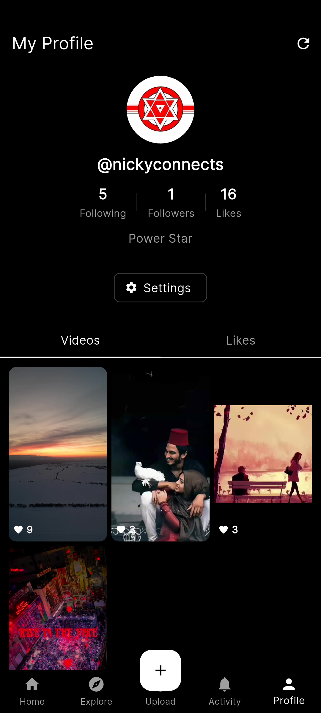

# Loops Flutter

A modern, high-performance Flutter client for [Loops](https://loops.video/), a short-form video platform focused on community and creativity. This application aims to provide a premium mobile experience for browsing, interacting, and creating content on the Loops network.

> [!IMPORTANT]
> **Status: Beta**  
> This project is currently in beta. Features are being actively developed and improved. You may encounter bugs or incomplete features. Please report issues!

## 📱 Screenshots

<p align="center">
  
  &nbsp;&nbsp;&nbsp;&nbsp;
  
</p>

## 🎯 Project Objective

The primary goal of this project is to build a fully featured, cross-platform mobile application that replicates the core functionality of the official Loops experience while leveraging Flutter's capabilities for smooth UI/UX. It serves as a comprehensive clone and client, adhering to the Loops API documentation.

## ✨ Key Features

*   **Immersive Video Feed**: Infinite scrolling vertical video feed with smooth playback, caching, and auto-play management.
*   **Authentication**: Secure OAuth-based login and signup flow, supporting multiple server instances.
*   **Explore & Discovery**:
    *   Trending hashtags and suggested accounts.
    *   Tag-based video grids to discover new content.
*   **User Profile**:
    *   Detailed profile view with follower/following stats and bio.
    *   Tabbed views for user's posted videos and liked videos.
*   **Social Interactions**:
    *   Like videos and view the list of likers.
    *   Comment on videos and reply to comments (threaded view).
    *   Notifications/Activity feed for interactions.
*   **Content Creation**:
    *   Video upload functionality with caption support.
    *   Video compression and optimization before upload.
*   **Settings & Customization**:
    *   Configurable app preferences (dark/system theme, auto-play, default feed).
    *   "For You", "Following", or "Local" feed selection.

## 🛠️ Tech Stack

*   **Framework**: Flutter
*   **State Management**: [Riverpod](https://riverpod.dev/) (Hooks Riverpod & Riverpod Generator)
*   **Navigation**: [GoRouter](https://pub.dev/packages/go_router)
*   **Networking**: [Dio](https://pub.dev/packages/dio) with Interceptors for Auth
*   **Code Generation**: [Freezed](https://pub.dev/packages/freezed) & [JSON Serializable](https://pub.dev/packages/json_serializable)
*   **UI/UX**: Custom `Shimmer` skeletons, `CachedNetworkImage`, `Google Fonts`.
*   **Video**: `video_player` and `video_compress`.

## 🚀 Getting Started

1.  **Clone the repository**
2.  **Install dependencies**:
    ```bash
    flutter pub get
    ```
3.  **Run code generation**:
    ```bash
    dart run build_runner build --delete-conflicting-outputs
    ```
4.  **Run the app**:
    ```bash
    flutter run
    ```


## 🤝 Contribution

Feel free to open issues or submit pull requests if you find bugs or want to add new features!
