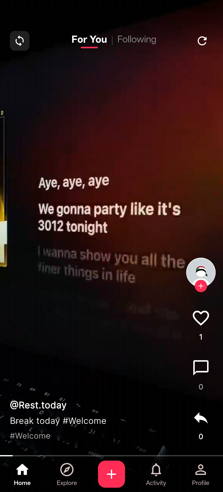
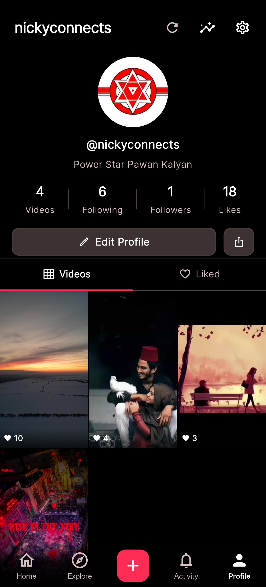
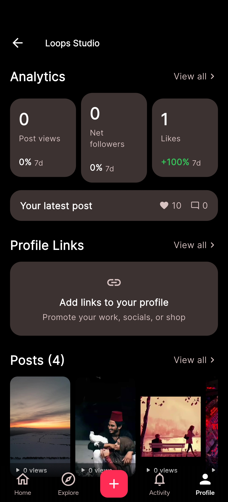
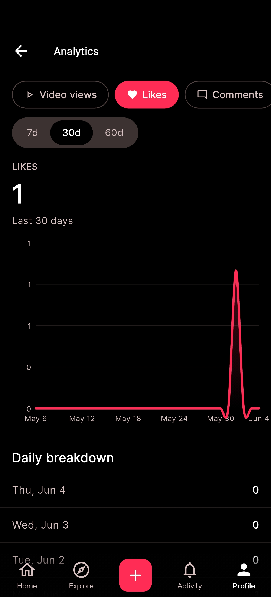

# Loops Flutter

A modern, high-performance Flutter client for [Loops](https://loops.video/), a short-form video platform focused on community and creativity. It delivers a premium experience for browsing, interacting, and creating content on the Loops network — on **mobile and desktop alike**, with a fully responsive Material 3 interface and light/dark theming.

> [!IMPORTANT]
> **Status: Beta**
> This project is under active development. You may encounter bugs or incomplete features — please report issues!

## 📱 Screenshots

<table>
  <tr>
    <td align="center"><br/><sub>Home Feed</sub></td>
    <td align="center"><br/><sub>Profile</sub></td>
    <td align="center"><br/><sub>Loops Studio</sub></td>
    <td align="center"><br/><sub>Studio Analytics</sub></td>
  </tr>
</table>

## 🎯 Project Objective

Build a fully featured, cross-platform client that replicates the core Loops experience while leveraging Flutter's strengths for smooth UI/UX. It adapts from a phone-shaped feed to a desktop layout with a navigation rail and a discovery sidebar, and follows a feature-first Clean Architecture.

## ✨ Key Features

*   **Immersive Video Feed**: Infinite vertical feed with smooth playback, prefetching/caching, and auto-play management. "For You" and "Following" tabs.
*   **Authentication**: Email/password and browser-based (OAuth) sign-in and registration, with support for custom server instances.
*   **Explore & Discovery**:
    *   Trending hashtags and suggested accounts.
    *   **Tappable hashtags** everywhere (feed captions, desktop sidebar) that open a paginated, full-screen tag feed.
*   **User Profile**:
    *   Profile view with follower/following stats, bio, and Followers/Following lists.
    *   Tabbed grids for posted and liked videos.
*   **Social Interactions**:
    *   Like videos and view likers; threaded comments and replies.
    *   Activity / notifications feed grouped by recency.
*   **Content Creation**: Video upload with caption support, plus client-side compression.
*   **🎬 Loops Studio** (creator dashboard):
    *   At-a-glance analytics — post views, net followers, and likes with 7-day trend.
    *   Interactive **analytics charts** (views/likes/comments/shares/followers over 7/30/60 days).
    *   Paginated, searchable, filterable list of your posts.
    *   Read-only profile-link analytics (per-link click counts).
*   **Material 3 & Theming**:
    *   Full Material 3 UI seeded from the Loops brand colour.
    *   **System / Light / Dark** theme switching from Settings, persisted across launches.
*   **🖥️ Desktop Experience**:
    *   Responsive layout — phone bottom nav → desktop left rail + right discovery sidebar.
    *   **Esc** acts as the Back button; mouse/trackpad dragging enabled for the feed.

## 🛠️ Tech Stack

*   **Framework**: Flutter (Material 3)
*   **State Management**: [Riverpod 3](https://riverpod.dev/) (annotations + generator; some manual providers)
*   **Navigation**: [GoRouter](https://pub.dev/packages/go_router) (ShellRoute + auth redirect guard)
*   **Networking**: [Dio](https://pub.dev/packages/dio) with auth/XSRF + retry interceptors
*   **Video**:
    *   Mobile / Web → [`video_player`](https://pub.dev/packages/video_player)
    *   Desktop (Linux/Windows/macOS) → [`media_kit`](https://pub.dev/packages/media_kit) (libmpv)
*   **Charts**: [`fl_chart`](https://pub.dev/packages/fl_chart) (Studio analytics)
*   **Code Generation**: [Freezed](https://pub.dev/packages/freezed) & [json_serializable](https://pub.dev/packages/json_serializable)
*   **UI/UX**: `cached_network_image`, `shimmer` skeletons, `google_fonts`
*   **Storage**: `shared_preferences` (token, instance, theme preference)

## 🗂️ Project Structure

Feature-first Clean Architecture. Cross-cutting app wiring lives in `lib/app/`, shared infrastructure in `lib/core/`, and each feature owns its `data` / `domain` / `presentation` layers.

```
lib/
├── main.dart                     # Bootstrap + runApp (deliberately tiny)
├── app/                          # Cross-feature app wiring
│   ├── loops_app.dart            # Root MaterialApp (themes, router, Esc-as-back)
│   ├── router/app_router.dart    # GoRouter config + auth redirect guard
│   ├── shell/                    # Persistent shell around the primary tabs
│   │   ├── main_screen.dart      # Responsive layout + tab/back state
│   │   ├── widgets/              # app_bottom_nav.dart, app_side_nav.dart
│   │   └── upload/               # video_upload_flow.dart, upload_progress_dialog.dart
│   └── widgets/                  # safe_error_widget.dart
├── core/                         # Shared infrastructure
│   ├── network/                  # Dio ApiClient + interceptors
│   ├── storage/                  # SharedPreferences wrapper
│   ├── theme/                    # Material 3 theme + theme-mode controller
│   ├── responsive/               # Breakpoints
│   ├── widgets/                  # Shared widgets (e.g. AppLoading)
│   ├── auth/                     # Browser auth helpers
│   └── utils/                    # Logger, helpers
└── features/                     # One folder per feature
    ├── feed/                     #   data/        (models, repositories)
    ├── explore/                  #   domain/      (models, repositories)
    ├── profile/                  #   presentation/(controllers, screens, widgets)
    ├── activity/
    ├── auth/
    ├── search/
    ├── settings/
    └── studio/                   # Loops Studio creator dashboard
```

## 🚀 Getting Started

**Prerequisites:** the Flutter SDK (Dart `^3.10`). For desktop video on Linux you also need libmpv (e.g. `sudo apt install libmpv2` / `mpv`).

1.  **Clone the repository**
2.  **Install dependencies**
    ```bash
    flutter pub get
    ```
3.  **(Optional) Run code generation** — only needed if you change a `@freezed`,
    `@JsonSerializable`, or `@riverpod`-annotated file (generated `*.g.dart` /
    `*.freezed.dart` outputs are committed):
    ```bash
    dart run build_runner build --delete-conflicting-outputs
    ```
4.  **Run the app**
    ```bash
    flutter run                 # mobile / default device
    flutter run -d linux        # desktop (also: macos, windows, chrome)
    ```

## 🤝 Contribution

Issues and pull requests are welcome — bug reports and new features alike!
